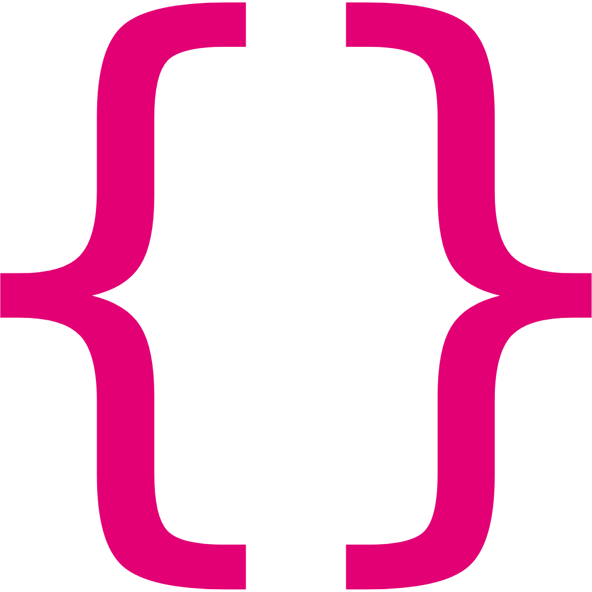
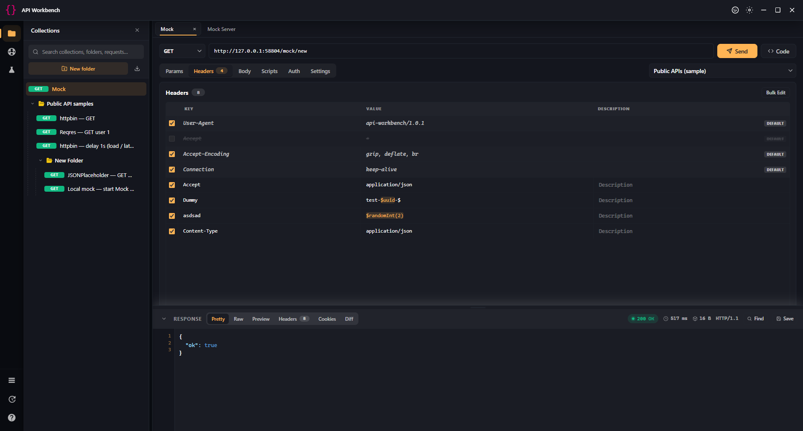
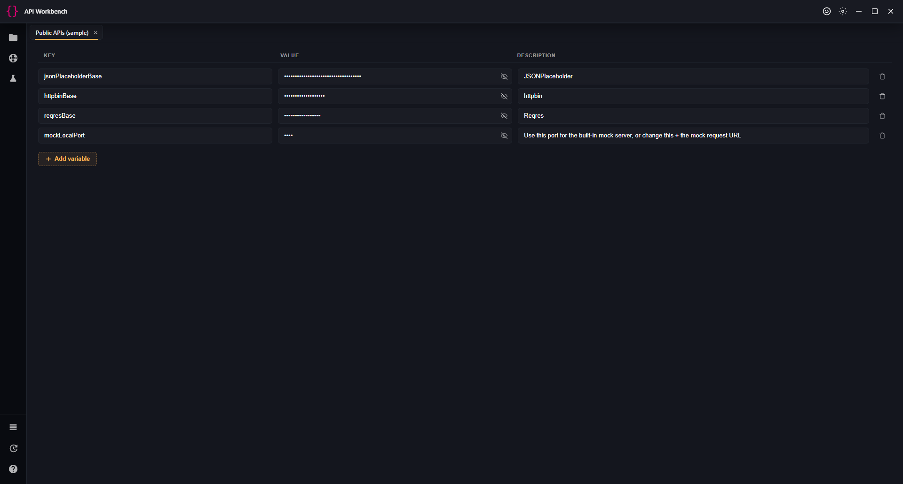
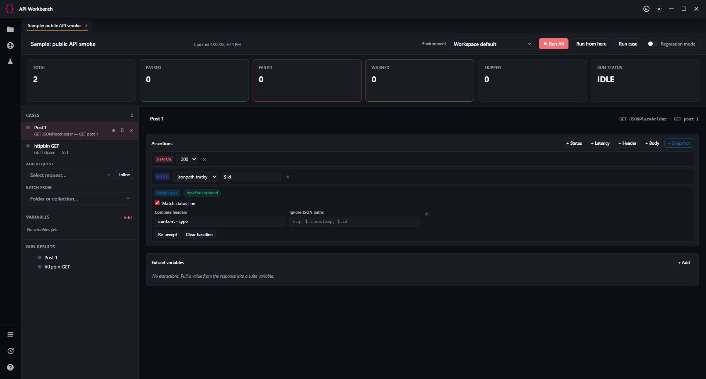
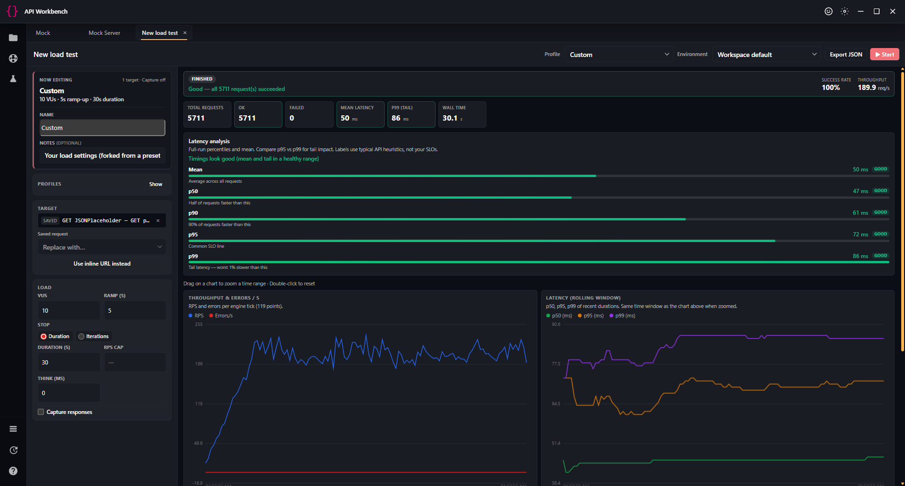
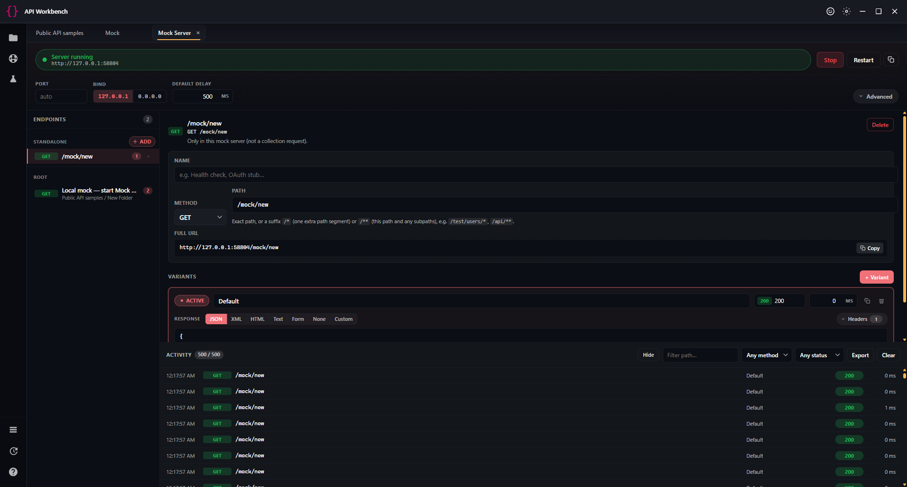

<p align="center">
  
</p>

<h1 align="center">API Workbench</h1>

<p align="center">
  A local-first, open-source <strong>Postman alternative</strong> for API testing and development, built with <strong>Angular 19</strong> and <strong>Electron</strong>.
</p>

<p align="center">
  
  
  
  <a href="LICENSE"></a>
</p>

Everything stays on your machine. No cloud sync, no account sign-up, no telemetry — just a fast desktop client for HTTP, WebSockets, mocks, and contract validation.

## Screenshots

<div align="center" style="max-width: 800px; margin-left: auto; margin-right: auto;">
  <table width="100%" border="0" cellspacing="0" cellpadding="6">
    <tbody>
      <tr>
        <td colspan="2" align="center" valign="top">
          <b>Main workspace</b> — collections, request bar, and response panel<br /><br />
          
        </td>
      </tr>
      <tr>
        <td width="50%" align="center" valign="top">
          <b>Environments</b> — keys, values, and descriptions<br /><br />
          
        </td>
        <td width="50%" align="center" valign="top">
          <b>Test suite</b> — cases and run<br /><br />
          
        </td>
      </tr>
      <tr>
        <td width="50%" align="center" valign="top">
          <b>Load test</b> — profile, charts, and run controls<br /><br />
          
        </td>
        <td width="50%" align="center" valign="top">
          <b>Mock server</b> — routes, requests, and responses<br /><br />
          
        </td>
      </tr>
    </tbody>
  </table>
</div>

## Documentation

- **GitHub Wiki (full guide):** [github.com/matthiaskopeinigg/api-workbench/wiki](https://github.com/matthiaskopeinigg/api-workbench/wiki)  
  — environments, `{{variables}}`, `$` placeholders, features overview, and roadmap.
- **Wiki source in this repository:** [`docs/wiki/`](docs/wiki/) (Markdown to copy into the wiki or to browse offline). Start with [`docs/wiki/README.md`](docs/wiki/README.md) for how to publish.
- **In the desktop app:** open **Help** from the left activity bar (bottom section) for a short reference and a button that opens the wiki in your **system browser**.

## Features

### Request workbench
- HTTP methods (GET, POST, PUT, PATCH, DELETE, HEAD, OPTIONS) with full header, query-param, cookie, and body editors.
- Body types: JSON, text, XML, GraphQL, form-data (with file upload), `x-www-form-urlencoded`, and binary uploads.
- Auth helpers: Basic, Bearer, API key, OAuth 2.0 (client credentials), and AWS SigV4.
- First-party textarea-based editors with syntax styling, search, and pretty-print for JSON / XML.
- `cURL` import, snippet export (Fetch, axios, Python `requests`, Go `net/http`, and more).

### Collections, history, environments
- Nested folders and collections with drag-and-drop (max depth 7).
- Environment and variable management with per-request overrides.
- Full request history with diffing between any two saved responses.

### Testing
- **Test Suites** — assertion framework (`pm.expect`-style) with snapshot / regression assertions.
- **Collection Runner** — run folders or collections with iteration counts, delays, and chained requests.
- **Contract tests** — validate responses against OpenAPI 3.x / Swagger 2.0 specs.
- **Load tests** — concurrent RPS scheduler with latency percentiles and error buckets.
- **Flow canvas** — visual SVG graph of request / transform / branch / assert nodes.
- **Mock server** — first-party HTTP mock server with variants, standalone endpoints, and hit log.
- **WebSocket / SSE** tabs for bidirectional and streaming protocols.

### Platform
- Local persistence via **SQLite** (`better-sqlite3`) in the Electron main process.
- HTTP/2 support with ALPN probing, SOCKS proxy support, and manual cookie jar.
- Command palette (`Ctrl/Cmd+K`), keyboard shortcuts panel, and theme picker (light, dark, Dracula, Monokai, Night Owl, Solarized, Ayu).

## Tech stack

- **Frontend**: Angular 19 (Signals, standalone components, OnPush change detection)
- **Desktop shell**: Electron 39
- **Persistence**: `better-sqlite3` in the main process, JSON documents via a generic store service
- **Styling**: SCSS with a theme-token design system
- **Testing**: Jasmine + Karma (headless Chrome)

## Installation

### Windows SmartScreen

The published installer is currently self-signed, so Windows SmartScreen may block it with "Windows protected your PC". Click **More info → Run anyway** to proceed.

### From source

```bash
git clone https://github.com/matthiaskopeinigg/api-workbench.git
cd api-workbench
npm install
```

## Running

### Development (hot reload, Electron + Angular)

```bash
npm run dev
```

Starts `ng serve` on `127.0.0.1:4200` and launches the Electron window once the dev server is up.

### Browser-only (no Electron)

```bash
npm start
```

Useful for quick UI tweaks. Electron-only features (file dialogs, native proxy, SQLite persistence, HTTP/2) are unavailable in this mode.

## Building

```bash
npm run build                 # Angular production build → dist/
npm run electron:build        # Build installers for all three platforms (win/linux/mac)
npm run electron:build:win    # Windows installer only (NSIS + portable)
npm run pack                  # Unpacked dev build in release/
```

Artifacts land in `release/`.

## Testing

```bash
npm test                                                  # Karma watch mode
npm test -- --watch=false --browsers=ChromeHeadlessNoSandbox   # CI-style single run
npm run lint                                              # tsc --noEmit on the app project
```

## Project layout

- `src/app/` — Angular renderer.
  - `core/` — services (collections, tabs, runner, contract validator, load test, flow executor, mock, WebSocket, snippets).
  - `features/workspace/` — UI: sidebar, titlebar, tabs (`request`, `test-suite`, `contract-test`, `load-test`, `flow`, `mock-server`, `websocket`, `history`, ...).
  - `models/`, `shared/` — domain types and shared UI helpers.
- `electron/` — main-process code: IPC handlers, `http.service.js` (HTTP/1.1 + h2 + SOCKS), `load.service.js`, `mock.service.js`, `store.service.js` (SQLite).
- `public/` — static assets (app icons).
- `docs/images/readme/` — images used in this README (SVG previews; optional PNGs for real screenshots).
- `docs/wiki/` — GitHub Wiki source (Markdown + sidebar).
- `plans/` — roadmap / design docs.
- `.github/workflows/` — CI (`ci.yml`) and multi-OS release (`release.yml`).

## Contributing

- **[CONTRIBUTING.md](CONTRIBUTING.md)** — how to file issues and open pull requests.
- **[CODE_OF_CONDUCT.md](CODE_OF_CONDUCT.md)** — community standards.
- **[SECURITY.md](SECURITY.md)** — how to report vulnerabilities.

Issues and feature requests: <https://github.com/matthiaskopeinigg/api-workbench/issues>

## License

Released under the [MIT License](LICENSE).

---
Built by [Matthias Kopeinigg](https://github.com/matthiaskopeinigg).
